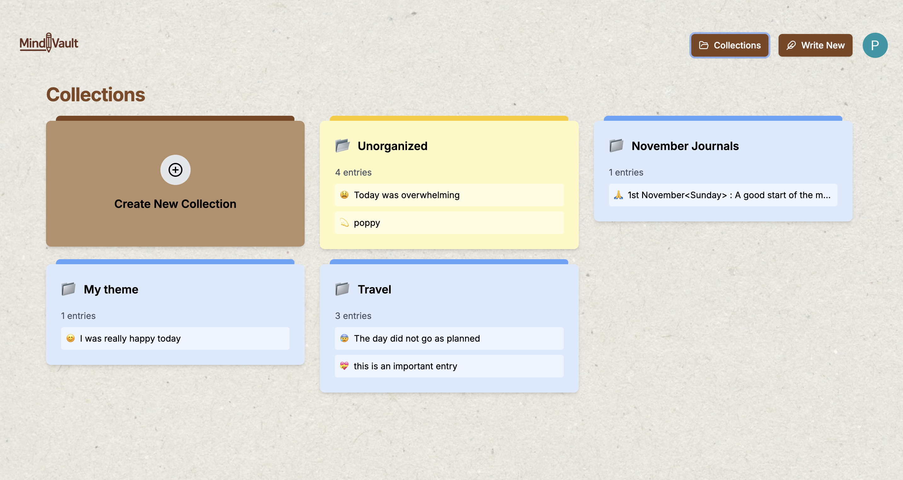

#  MindVault

**MindVault** is a minimal and beautiful journaling web app designed to help you **capture your thoughts, feelings, and memories** in an organised and meaningful way.

Whether you're reflecting on your day, brainstorming your next big idea, or tracking your mood over time—MindVault offers a secure, distraction-free space to write freely and deeply.





## Features

- Beautiful and minimal journaling experience  
- Rich text editor for expressive entries  
- Create, edit, delete journal entries  
- Save drafts before publishing  
- Search and filter entries  
- Secure private account space (Clerk)  
- Dashboard to view timeline of entries
- Thoughtful journaling prompts for each selected mood

## Tech Stack

| Layer        | Technology |
|-------------|------------|
| **Frontend** | Next.js, React, Tailwind CSS, Shadcn UI |
| **Backend**  | Prisma, Neon (Postgres), ArcJet |
| **Auth**     | Clerk |
| **Editor**   | Shadcn Rich Text Editor |
| **Deployment** | Vercel |

## Architecture

- Next.js App Router with Server Actions  
- Prisma ORM + Neon database  
- Journal CRUD implemented via server actions  
- Middleware-based auth protection  
- ArcJet for security + rate limiting  
- Shadcn rich text editor integration  
- Optimised dynamic routing for entries  
- Deployed on Vercel

## Getting Started (Installation & Setup)
### Clone the repo
```bash
git clone https://github.com/prarthana1998/MindVault.git
cd mindvault
```

### Install dependencies
```bash
npm install
```

### Set up environment variables
Create an `.env` file and add the following:
```env
NEXT_PUBLIC_CLERK_PUBLISHABLE_KEY=
CLERK_SECRET_KEY=
NEXT_PUBLIC_CLERK_SIGN_IN_URL=/sign-in
NEXT_PUBLIC_CLERK_SIGN_UP_URL=/sign-up
NEXT_PUBLIC_CLERK_AFTER_SIGN_IN_URL=/dashboard
NEXT_PUBLIC_CLERK_AFTER_SIGN_UP_URL=/dashboard
DATABASE_URL=
ARCJET_KEY=
```

### Set up the database
```bash
npx prisma migrate dev
```

### Run dev server
```bash
npm run dev
```
## Folder Structure
```bash
/app
  /(auth)
  /(main)
/actions
/components
/hooks
/lib
/prisma
```

## Roadmap
- Add mood tracking
- Add analytics dashboard
- Mobile UI improvements
- AI-powered journaling prompts

## Link to live project
[mind-vault-gilt.vercel.app](https://mind-vault-gilt.vercel.app/)

## Contributing

Contributions are welcome! Please feel free to open issues, fork the repo, and submit pull requests.

## License

This project is licensed under the **MIT License**.


